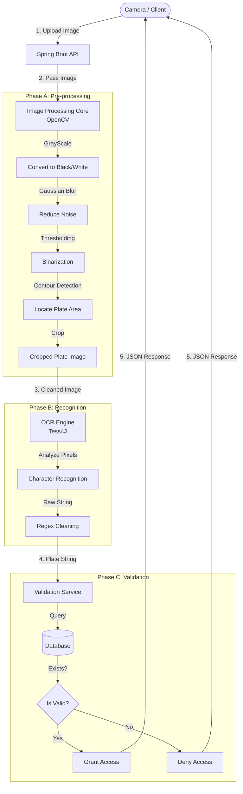

---

# License Plate Recognition (LPR) System Workflow

## 1. High-Level Architecture

This document outlines the end-to-end data flow for the Automated License Plate Recognition system built with Spring Boot, OpenCV, and Tess4J.



---

## 2. Detailed Workflow Stages

### Phase 1: Input & Ingestion

* **Actor:** Client Device (CCTV Camera, Mobile App, Postman).
* **Action:** Captures a snapshot of the vehicle.
* **Protocol:** Sends an HTTP `POST` request to the backend.
* **Endpoint:** `/api/ocr/check`
* **Payload:** `multipart/form-data` (Key: `image`, Value: `car_capture.jpg`).

### Phase 2: Image Processing (The "Eyes")

* **Technology:** **OpenCV (OpenPnP)**.
* **Goal:** To isolate the license plate from the car body and background.
* **Steps:**
1. **Grayscale Conversion:** Reduces color complexity (3 channels -> 1 channel).
2. **Noise Reduction:** Applies Gaussian Blur to smooth out grain/dust.
3. **Binarization (Thresholding):** Converts the image to pure Black & White using Otsu's method. This makes characters stand out against the background.
4. **ROI Extraction (Region of Interest):** Detects rectangular contours to find the plate and **Crops** it.


### Phase 3: Text Recognition (The "Brain")

* **Technology:** **Tess4J (Tesseract OCR)**.
* **Goal:** To convert the pixel visual data into a String.
* **Steps:**
1. **Input:** Receives the *Cropped Binary Image* from Phase 2.
2. **Recognition:** Scans pixel patterns against the `eng.traineddata` file.
3. **Output:** Returns a Raw String (e.g., `Detected: "29A - 123. 45\n"`).


### Phase 4: Data Cleaning & Normalization

* **Technology:** Java Regex.
* **Goal:** To ensure the data matches the Database format.
* **Logic:**
* Remove all non-alphanumeric characters (spaces, dots, hyphens, newlines).
* Convert to Uppercase.
* **Example:** `29A - 123.45`  `29A12345`.


### Phase 5: Business Logic & Database Validation

* **Technology:** Spring Data JPA / MySQL.
* **Logic:**
1. Query the database: `SELECT * FROM plates WHERE number = '29A12345'`.
2. **Scenario A (Registered):**
* Check status (Active/Expired/Blacklisted).
* If Active  Return `SUCCESS`.


3. **Scenario B (Unregistered):**
* Log the entry as "Guest" or "Unknown".
* Return `NOT_FOUND` or `DENIED`.


---

## 3. Data Transformation Table

| Stage | Input Data | Operation | Output Data |
| --- | --- | --- | --- |
| **1. Controller** | `MultipartFile` (JPG/PNG) | Receive Request | `byte[]` |
| **2. OpenCV** | `byte[]` | Decode & Grayscale | `Mat` (Gray) |
| **3. OpenCV** | `Mat` (Gray) | Thresholding & Crop | `Mat` (Binary ROI) |
| **4. Converter** | `Mat` | Java Conversion | `BufferedImage` |
| **5. Tess4J** | `BufferedImage` | doOCR() | `String` (Raw) |
| **6. Service** | `String` (Raw) | Regex Replace | `String` (Clean) |
| **7. Repository** | `String` (Clean) | `findByPlateNumber()` | `CarEntity` |

---

## 4. Response Structure (JSON)

**Success Case:**

```json
{
  "timestamp": "2023-10-27T10:00:00",
  "status": "ALLOWED",
  "plate_number": "29A12345",
  "vehicle_owner": "Nguyen Van A",
  "message": "Gate Opening..."
}

```

**Failure Case:**

```json
{
  "timestamp": "2023-10-27T10:00:05",
  "status": "DENIED",
  "plate_number": "30E99999",
  "message": "Unregistered Vehicle"
}

```